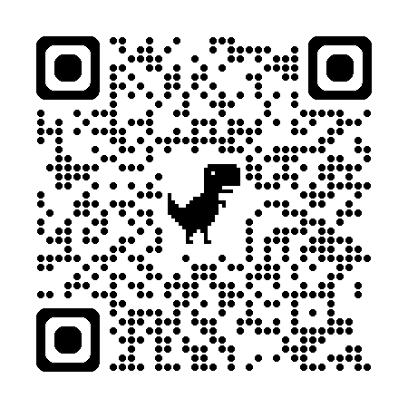

## Una pregunta para empezar

Cuando hablamos de **"democratizar la inteligencia artificial"**,
¿qué  estamos asumiendo?

- Internet estable
- Hardware suficiente
- Acceso a modelos inteligentes
- Autonomía frente a proveedores

<!-- ::: {.fragment} -->
**Hoy quiero proponer que ninguna de las cuatro está garantizada en México** — y que sin ellas, *democratización* es retórica.
<!-- ::: -->

---

## Tesis

 
 

> La IA se presenta como fuerza democratizadora,
> pero su democratización real está condicionada por **al menos tres capas materiales**.

 
 

::: {.r-fit-text}
**infraestructura · soberanía · commons**
:::

<!-- . . .

Sin esas tres capas, "democratización" es retórica. -->

---

## Ubicación

 
 

- Construyo herramientas y realizo investigación con IA
- He pagado APIs para tener acceso a modelos de frontera
- Administro hardware con aplicaciones usando IA

# Bloque INFRAESTRUCTURA  {background-color="#1a1a1a"}

<!-- ## Las precondiciones materiales -->

---

## Cuatro condiciones que se asumen

| Se asume | Realidad mexicana |
|---|---|
| Internet estable | Brecha de conectividad nacional, no urbana |
| Acceso a modelos | APIs con costo por uso |
| Hardware suficiente | Costo prohibitivo del cómputo local |
| Autonomía frente a proveedores | Cambios unilaterales de política |

 

::: aside
Anthropic, abril 2026: cambio de política, 48 h para reconfigurar proyectos y con pago.
:::

---

## El proyecto que ilustra el problema

 

**Asistente de IA para Energía en Edificaciones**

Un asistente conversacional sobre una base de conocimiento curada del tema, construida a partir de las clases del curso, con perspectiva de género.

 

¿Qué se necesita para sostenerlo desde una universidad pública mexicana?
Cómputo, autonomía algorítmica, datos propios, criterio editorial.

# Bloque COMMONS {background-color="#1a1a1a"}

## Contexto

Todo lo que produzco como investigador descansa sobre cosas que **otras personas pusieron en común**:

::: {.columns}
::: {.column width="50%"}
- **Datos** abiertos 
- **Software libre**
- **Python**
:::
::: {.column width="50%"}
- **Formatos libres**
- **Educación abierta**
- **Hardware libre**
:::
:::

A ese  —recurso · comunidad · reglas propias— se le llama un ***común***, *commons* en inglés.

>pastizales comunales europeos, Elinor Ostrom; hoy se extiende a lo digital y científico.

---

## La tensión

 

<!-- ::: {.fragment .fade-in} -->
La IA actual se construyó **extrayendo commons abiertos**…
<!-- ::: -->

 
<!-- ::: {.fragment .fade-in} -->
…y los devuelve **cercados** detrás de APIs, suscripciones y alucinaciones.
<!-- ::: -->

 

<!-- ::: {.fragment .fade-in} -->
Analogía: investigación pública publicada en revistas de acceso restringido por suscripción.
<!-- ::: -->

---

## Asimetrías

 

- Datos abiertos ≠ modelos abiertos
- *Open weights* ≠ software libre — depender de Meta o Mistral sigue siendo dependencia
- El Sur Global aporta datos (climáticos, lingüísticos, culturales) y consume servicios
- Paradoja: la IA acelera el cambio climático que parte de la academia mexicana intenta mitigar

<!-- --- -->

<!-- ## Ejemplo desde mi trabajo

**Dispositivo libre para evaluar confort adaptativo con smartwatch.**

Datos producidos localmente, hardware abierto, metodología publicada — el tipo de commons que el Sur Global *sí* puede producir, y que los modelos comerciales no incorporan.

# Bloque C {background-color="#1a1a1a"}

## Producir commons desde la universidad pública

--- -->

## Frente al cercamiento ...

 

> **Producir commons en lugar de consumirlos cercados**

 

<!-- No como solución completa al problema, sino como **demostración de que hay otra dirección posible** — y de lo que requiere institucionalmente sostenerla. -->

<!-- . . . -->

- Reproducibilidad como acto político, no sólo metodológico
- Generar conocimiento libre como acto político
- Documentar el uso de IA en investigación
- Educación abierta como contrapeso al cercamiento

<!-- --- -->

<!-- ## Lo que ya está en marcha

::: {.incremental}
- **Ener-Habitat** — paquete en PyPI, 2,600+ usuarios
- **HackODS UNAM 2026** — Quarto + GitHub Pages + `uv` + política de tres niveles de IA con `ai-log.md`
- **Adopción institucional de Python en IER-UNAM**
- **HardwareX** — hardware abierto en revista de hardware abierto
- **AltamarMx.github.io / cv_quarto** — stack reproducible coherente
:::

. . .

Esta misma presentación es un *commons*: Quarto + GitHub Pages, fuente abierta.

--- -->

## Cierre

 

> No vine a esta mesa con una solución.

Vine a proponer continuar con el desarrollo de **educación abierta**, recursos y un acercamiento básico a la IA antes que a la IA misma.

Los debates sobre IA y orden global deben incluir tres palabras:

::: {.r-fit-text}
**accesibilidad · soberanía · commons**
:::

---

## Gracias

{.center}

::: aside
Presentación construida con Quarto + revealjs · fuente disponible en el repositorio del evento.
:::
